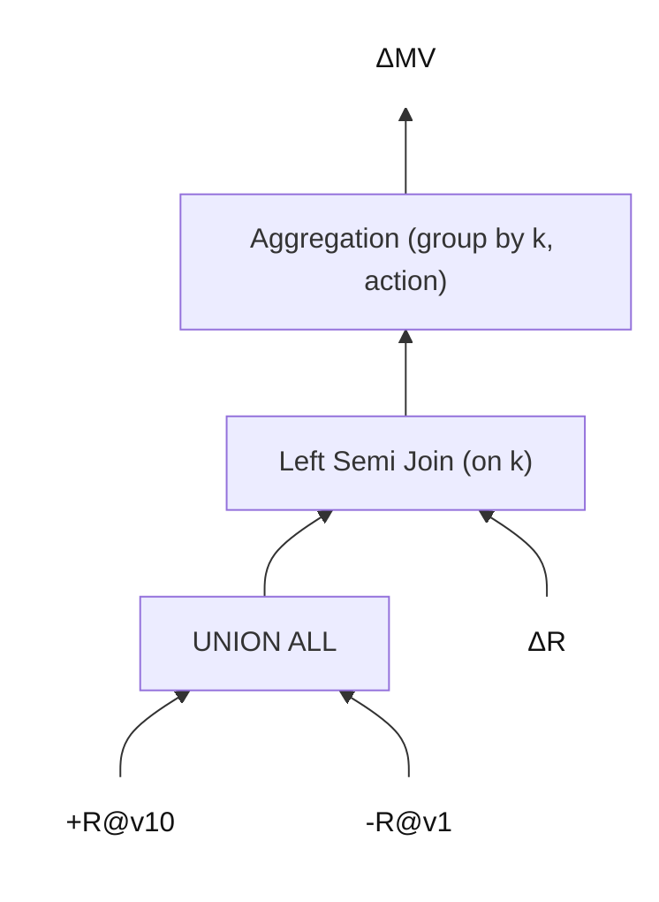

# 目标
## 总目标
实现对内表 OlapTable 的增量物化视图（IVM, Incremental Materialized View）的支持。

支持对基表的 DELETE、INSERT、UPDATE 操作的增量维护。

# 前置需求
## OlapTable 读取多版本

### 目标
给定一个 OlapTable，维护 base_version 和 head_version。
- FE metadata 可以读取 `[base_version, head_version]` 每个版本的元数据，用于查询。
- BE 上，>=base_version 的版本数据都保留在 BE 上，供查询使用，不能被 compaction 掉。

为了测试方便，增加几个命令：
- ALTER TABLE <table_name> SET BASE_VERSION = x
- SQL 中 `FROM table_name VERSION(x)` 来指定版本读取。
- SHOW VERSIONS FROM table_name 来显示所有版本信息。

### 已实现的 base_version 相关能力
目前已落地的命令/能力（按当前实现范围）：

1. **设置 base_version**  
   `ALTER TABLE <table_name> SET ("base_version" = "<x>")`

2. **指定读取版本**  
   `SELECT ... FROM <table_name> VERSION(x)`  
   FE 做范围校验并下传到 BE。

3. **查看版本信息**  
   `SHOW VERSIONS FROM <table_name>`  
   输出 `DbName / TableName / PartitionName / PhysicalPartitionId / VisibleVersion / BaseVersion`。

同时，BE 侧的版本保留策略已覆盖：
- **Primary/Unique Key（updatable）表**：`TabletUpdates::remove_expired_versions` 按 base_version 保留。
- **Duplicate Key 表**：`Tablet::delete_expired_stale_rowset` 加入 base_version 保留逻辑。
- **Lake（存算分离）表**：FE 在 vacuum 请求的 `retain_versions` 中加入 base_version，避免 vacuum 删除。


### 简易支持
**如果只是“走通流程”的 query-only IVM**，最小化可行条件是：

1. **禁用迁移/重平衡**  
   让 tablet 不变动位置，避免“新位置只有最新版本”的问题。

2. **禁用旧版本清理**  
   让 `>= base_version` 的版本一直保留在 BE。

3. FE 只做：  
   - `base_version` 存储/设置  
   - `VERSION(x)` 语法 + 下传版本号  
   - 基本范围校验（`x <= visibleVersion`、`x >= base_version`）

如果你确认这是一个**受控测试环境**，这条路线是合理的。

你要我帮你确认具体哪些 BE 配置可以关掉迁移/清理吗？

### 关闭负载均衡的配置（建议组合）
如需在测试环境中**尽可能关闭负载均衡/迁移**，建议同时设置：

1. `tablet_sched_disable_balance=true`  
   关闭 FE TabletScheduler 的 balance 调度，同时同步到 StarMgr 关闭后台 shard 负载均衡检查。

2. `tablet_sched_disable_colocate_balance=true`  
   关闭 colocate 表的自动平衡。

3. `lake_enable_balance_tablets_between_workers=false`  
   关闭存算分离（Lake）场景下的 worker 间 tablet 平衡。

说明：
- 上述配置主要关闭“均衡/迁移”类行为，**不等同于**关闭异常修复类调度（如副本丢失修复）。
- 如果你还希望禁用异常修复调度，需要再明确范围与目标行为。


## 读取基表 Changes

### 简易支持

给定两个 version v1 和 v2，能够读取 OlapTable 在这两个版本之间的变化（changes）。

返回格式中，增加一列 `action` 类型为 SMALLINT，值为 +1 和 -1，分别表示 INSERT 和 DELETE。UPDATE 拆分为 DELETE + INSERT。

为了测试方便，增加一个命令：
- `SELECT ... FROM table_name CHANGES BETWEEN v1 AND v2` 来指定版本范围读取变化。

支持范围
- Duplicate Key 表：只支持 INSERT。
- Primary Key 表：支持 INSERT、DELETE、UPDATE（拆分为 DELETE + INSERT）。

# 设计

## 总体流程

1. 创建 MV 时，通过 analyzer 判断 MV 是否可以增量维护。如果满足条件标记为“可增量”。需要满足的条件包括：
   1. MV 指定的刷新模式是 IVM。
   2. 整个 MV 的 plan 所有算子都支持增量维护。
2. MV 刷新时，决策使用的刷新模式。
   - MV 必须被标记为“可增量”。
   - 如果刷新模式为 IVM，那么使用增量维护。
   - ~~如果刷新模式为 AUTO，那么根据启发式策略来决定使用增量刷新还是全量刷新 (暂时不考虑这一点)~~：
      - ~~增量刷新 plan 与全量刷新 plan 的 cost 对比。~~
3. 对于增量刷新，生成增量维护 plan。
4. 调度执行增量维护 plan，并更新 MV 的版本信息。

## 主要细节

我们需要一套框架，来
1. 判定 MV 是否可以增量维护，
2. ROW_ID 的推导。
3. 具体的增量算子改写流程。

对框架的要求：
1. 清晰、专业、优雅。
2. 拓展性强，易于维护。

### 1. 判定 MV 是否可增量维护
在 MV 创建阶段，分析 MV 定义的 plan，判断是否满足增量维护的条件。
1. MV 指定的刷新模式是 IVM。
2. 整个 MV 的 plan 所有算子都支持增量维护。

### 2. ROW_ID 推导
需要一套 rule，从叶子节点（基表 ScanOperator）自下而上推导出每个算子的 ROW_ID 定义。

### 3. 增量维护 plan 的生成
对于第三步，增量维护 plan 的生成，主要涉及以下几个方面：
MV 维护
- 每个基表已经刷新到的 version `flushed_version`。

主流程
1. 在根节点插入一个 DeltaOperator，表示它下面的 plan 是增量维护的。
2. 增加一组 rule，把 DeltaOperator → 每种Operator 的转换规则写好，自上而下的把 DeltaOperator 推导 ScanOperator 上。
3. 对于 ScanOperator 基表
   - 如果是 changes，那么 from_version=flushed_version ，to_version=table_latest_visible_version 。
   - 如果是版本读取，那么可能是 flushed_version，也可能是 table_latest_visible_version，取决于改写的 rule。
4. 迭代应用 rule，如果最终整个 plan 不存在 DeltaOperator，那么说增量改写成功，否则增量改写失败，回退到全量刷新。


问题
- 由于统计信息并不支持 changes，因此我们需要自己手动指定 join 顺序，在 rule 中生成 join 的时候。例如把 changes 放到右侧。

## 实现过程

## Group-by Aggregation 的增量维护
首先，我们只实现 group-by aggregation。

### ROW_ID 推导
对于 group-by aggregation 来说，ROW_ID 定义为 group by key 的值。对于基表 R 上的 group by `key`，ROW_ID 定义为 R.key。

### 增量维护 plan 的生成

实现方式，对于基表 R，以及 group by `key`、聚合函数 `f`，我们这样去改写一个增量算子：
  - 在旧版 R 与新版 R 上读取受影响的 key (affected_key) 的所有行，重新计算算子 `f` 的结果，减掉旧结果，加上新结果。

举个例子，对于下面的 Aggregation MV 示例，转化为的普通算子组合如 mermaid 图所示。
```sql
SELECT k, count(1) as cnt FROM R GROUP BY k;
```

